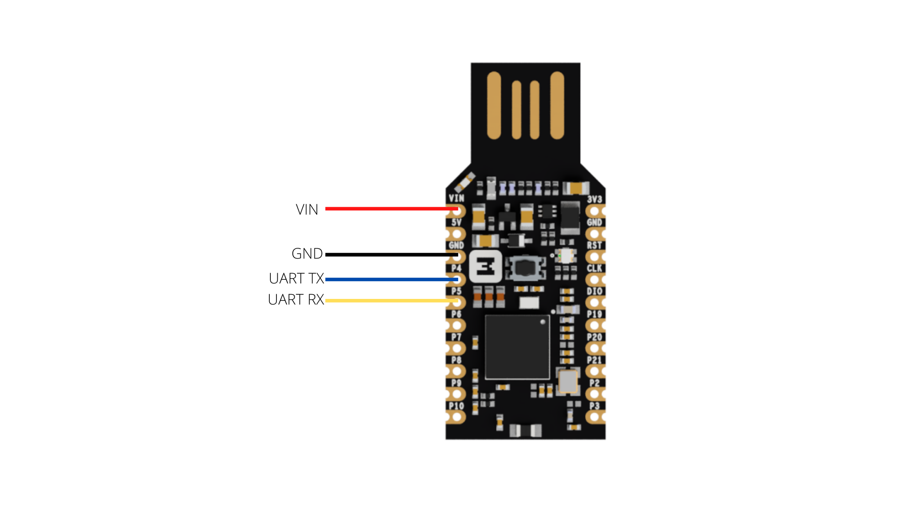

# GreenHomeLan_ThreadDongle
Client and server Thread (over CoAP) for makediary dongle for nrf52840

## Flash prebuilt files
If you want to flash the prebuit files, you dont need to setup the environement. 

1. Push and hold the button and plug your dongle into the USB port to boot the dongle in UF2BOOT. It will mount as a Mass Storage Device called UF2BOOT.

2. Drag and drop the .uf2 file onto the UF2BOOT volume.

3. The dongle will reboot and run the aplication.


# Dongles connection


## Environement setup 

Update and upgrade:
``` 
sudo apt update
sudo apt upgrade 
```

Install the required dependencies:
```
sudo apt install --no-install-recommends git cmake ninja-build gperf \
ccache dfu-util device-tree-compiler wget \
python3-dev python3-pip python3-setuptools python3-tk python3-wheel xz-utils file \
make gcc gcc-multilib g++-multilib libsdl2-dev libmagic1
```

Verify the versions of the main dependencies installed on your system by entering::
```
cmake --version
python3 --version
dtc --version
```

Install west
``` 
pip3 install --user west
echo 'export PATH=~/.local/bin:"$PATH"' >> ~/.bashrc
source ~/.bashrc
```

Get the makediary code
```
west init -m https://github.com/makerdiary/ncs-playground --mr main my-workspace
cd my-workspace
west update
west zephyr-export
```

Install aditional python dependencies
```
pip3 install --user -r zephyr/scripts/requirements.txt
pip3 install --user -r nrf/scripts/requirements.txt
pip3 install --user -r bootloader/mcuboot/scripts/requirements.txt
```

Install Zephyr SDK
```
cd ~
wget https://github.com/zephyrproject-rtos/sdk-ng/releases/download/v0.16.1/zephyr-sdk-0.16.1_linux-x86_64.tar.xz
wget -O - https://github.com/zephyrproject-rtos/sdk-ng/releases/download/v0.16.1/sha256.sum | shasum --check --ignore-missing
```

Extract archive:
```
tar xvf zephyr-sdk-0.16.1_linux-x86_64.tar.xz
```

Run the Zephyr SDK bundle setup script:
```
cd zephyr-sdk-0.16.1
./setup.sh
```

Install udev rules, which allow you to flash most Zephyr boards as a regular user:
```
sudo cp ~/zephyr-sdk-0.16.1/sysroots/x86_64-pokysdk-linux/usr/share/openocd/contrib/60-openocd.rules /etc/udev/rules.d
sudo udevadm control --reload
```

## Build Client

``` 
chmod +x build.sh
./build.sh thread_dongle_client
```

The .uf2 generated file can be find in build/thread_dongle_client.uf2

## Build Server
``` 
chmod +x build.sh
./build.sh thread_dongle_server
```

The .uf2 generated file can be find in build/thread_dongle_server.uf2

## Flash the dongle
To flash the dongle you can drag and drop the .uf2 files generated in the build step.


#TODO
[ ] Update readme file